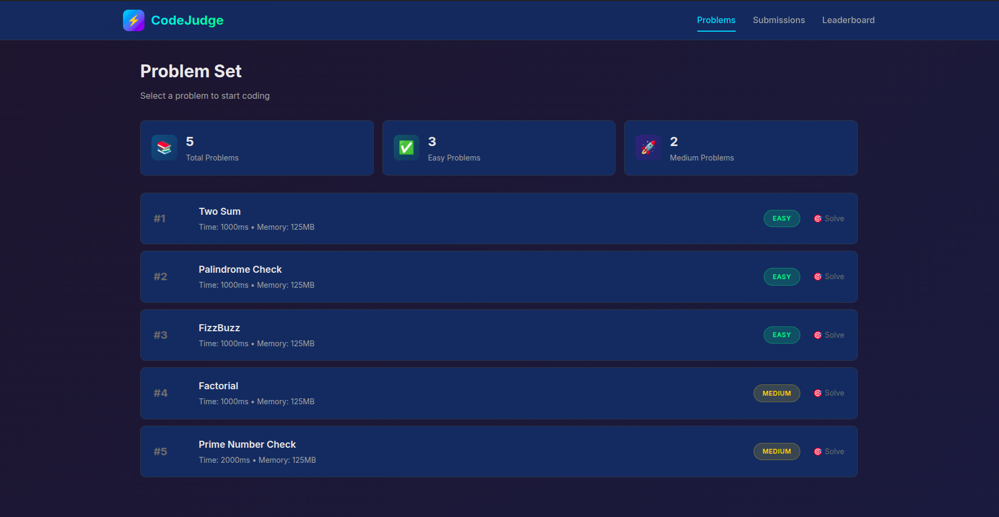
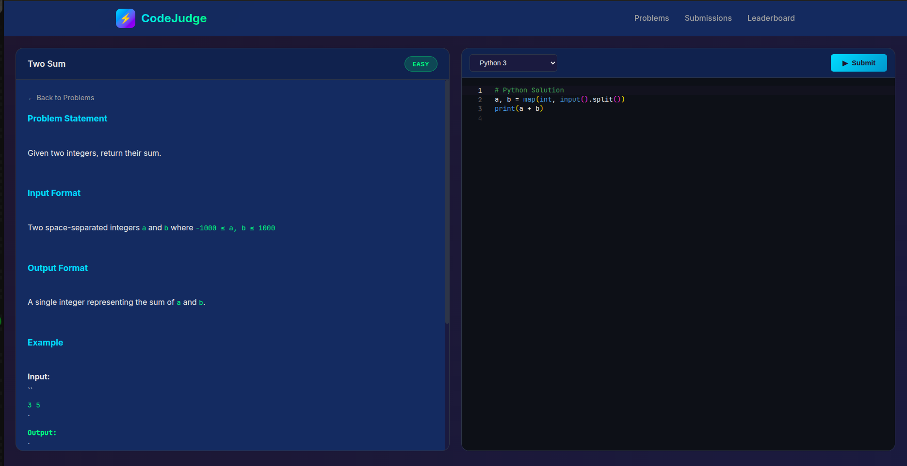
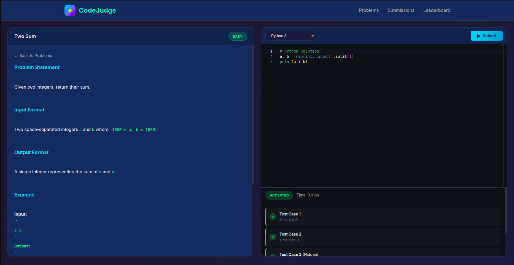

Disclaimer: I am not the og author. This project format is from jamilxt. I just add some backend stuff for vercel + render deploy. All credit to Jamilxt. 

# 🚀 CodeJudge - Online Judge System

A simple online judge system where you can solve programming problems and get your code automatically evaluated. Think of it like LeetCode or HackerRank, but running on your own computer!

**Works on Windows, Linux, and macOS!** 🖥️ 🐧 🍎

---

## 📸 Screenshots

### Problem List


### Code Editor


### Submission Result


---

## 📱 Mobile & Desktop Apps

Looking for the Android or Desktop version? We have a **Kotlin Multiplatform (KMP)** app that connects to this backend!

👉 **[Go to CodeJudge KMP Repo](https://github.com/jamilxt/online-judge-kmp)**

---

## 📖 What is an Online Judge?

An **online judge** is a system that:
1. Shows you a programming problem (like "add two numbers")
2. Lets you write code to solve it
3. Runs your code against test cases
4. Tells you if your solution is correct ✅ or wrong ❌

---

## 🎯 What Can You Do With This?

- ✅ Browse programming problems (Easy, Medium difficulty)
- ✅ Write code in **Python, Java, C++, JavaScript, or C**
- ✅ Submit your code and see instant results
- ✅ See which test cases passed or failed
- ✅ Practice coding in a beautiful dark-themed editor

---

## 🛠️ Requirements

### Must Have (All Platforms):
| Software | Why You Need It | How to Check |
|----------|-----------------|--------------|
| **Java 17+** | Runs the server | `java -version` |
| **Maven** | Builds the project | `mvn -version` |

### For Running Code - Choose One Mode:

#### Option A: Local Mode (easier to set up)

<details>
<summary><b>🪟 Windows</b></summary>

| Language | How to Install |
|----------|----------------|
| Python | [Download Python](https://www.python.org/downloads/) - check "Add to PATH" |
| Java | Already included with Java 17 |
| C/C++ | [Download MinGW](https://www.mingw-w64.org/downloads/) or use Visual Studio |
| Node.js | [Download Node.js](https://nodejs.org/) |

</details>

<details>
<summary><b>🐧 Linux (Ubuntu/Debian)</b></summary>

```bash
sudo apt install python3 gcc g++ nodejs
```

</details>

<details>
<summary><b>🍎 macOS</b></summary>

```bash
brew install python3 gcc node
```

</details>

#### Option B: Docker Mode (more secure)

📖 **[Read the Full Docker Setup Guide →](DOCKER_GUIDE.md)**

Quick links:
| Platform | How to Install |
|----------|----------------|
| Windows | [Docker Desktop for Windows](https://docs.docker.com/desktop/install/windows-install/) |
| Linux | [Docker for Linux](https://docs.docker.com/engine/install/) |
| macOS | [Docker Desktop for Mac](https://docs.docker.com/desktop/install/mac-install/) |

---

## 🚀 Quick Start (5 minutes)

### Step 1: Open Terminal/Command Prompt
Navigate to the project folder:
```bash
cd path/to/online-judge
```

### Step 2: Run the Application

**On Windows (Command Prompt or PowerShell):**
```cmd
mvn spring-boot:run
```

**On Linux/macOS:**
```bash
./mvnw spring-boot:run
```

Wait until you see:
```
Started OnlineJudgeApplication in X seconds
Initialized 5 sample problems
```

### Step 3: Open Your Browser
Go to: **http://localhost:8081**

### Step 4: Solve a Problem!
1. Click on any problem (like "Two Sum")
2. Write your code in the editor
3. Click **Submit**
4. See if you got **ACCEPTED** ✅

---

## ▲ Deploy Frontend on Vercel

This repository now includes Vercel configuration:
- `vercel.json` for routing static pages
- `api/[...path].js` as an API proxy

### Important
Vercel hosts the UI and API proxy layer. Your Java backend must still run on a separate host (for example: Render, Railway, Fly.io, VPS).

### Steps
1. Push this repo to GitHub.
2. Import the repo in Vercel.
3. In Vercel Project Settings → Environment Variables, add:
  - `BACKEND_URL` = your deployed Spring Boot base URL (example: `https://your-api.example.com`)
4. Deploy.

After deployment:
- `/` serves the problem list UI
- `/problem.html` serves the editor page
- `/api/*` is proxied to your Spring Boot backend via `BACKEND_URL`

---

## 🚂 Deploy the Backend on Render

Render should host only the Spring Boot API for this project.

### ✅ Persistent Database (Recommended)
To make problems survive restarts/redeploys, use the included Render blueprint with **both**:
- a Docker Web Service (`online-judge-backend`)
- a free PostgreSQL database (`online-judge-db`)

The blueprint wires database credentials automatically and enables the `render` Spring profile.

### Recommended: Docker Web Service
Use a **Docker Web Service** on Render so the backend has the compilers it needs to run submissions in `executor.mode=local`.

This repository includes a [`render.yaml`](render.yaml) blueprint and a [`Dockerfile`](Dockerfile) for that setup.

The blueprint uses Render's free web service plan, so you should not be forced onto the paid Starter tier.

It also includes a free PostgreSQL instance so imported problems are stored persistently.

### If you prefer a Java Web Service
You can also configure a Java service manually with:

**Build Command**
```bash
mvn clean package -DskipTests
```

**Start Command**
```bash
java -jar target/online-judge-1.0.0.jar
```

### Port Handling
Render provides the `PORT` variable automatically. The app is configured to use it via:

```yaml
server:
  port: ${PORT:8081}
```

### Vercel Connection
After Render deploys, copy your backend URL and set it in Vercel:

```text
BACKEND_URL=https://your-render-service.onrender.com
```

That gives you this flow:

Browser → Vercel frontend → Vercel `/api/*` proxy → Render Spring Boot backend

### Admin Import Endpoint

You can upload a whole problem set with one request:

```http
POST /api/admin/import
Content-Type: application/json
```

Example body:

```json
{
  "clearExisting": true,
  "problems": [
    {
      "title": "Add Two Numbers",
      "description": "## Problem Statement\nReturn the sum of two integers.",
      "difficulty": "EASY",
      "timeLimit": 1000,
      "memoryLimit": 128000,
      "testCases": [
        {
          "input": "3 5",
          "expectedOutput": "8",
          "isHidden": false,
          "orderIndex": 0
        }
      ]
    }
  ]
}
```

Response:

```json
{
  "problemsImported": 1,
  "testCasesImported": 1,
  "clearedExisting": true
}
```

---

## ⚙️ Configuration

The main configuration file is `src/main/resources/application.yml`.

For Render production, this repo also includes `src/main/resources/application-render.yml`.

### Database Profiles

- `application.yml` (default/local): H2 in-memory database
- `application-render.yml` (Render): PostgreSQL with durable storage

On Render, the profile is enabled via:

```yaml
SPRING_PROFILES_ACTIVE=render
```

This is already set in [`render.yaml`](render.yaml).

### Changing the Execution Mode

Find this section in the file:

```yaml
executor:
  mode: local    # Change to 'docker' for Docker mode
```

| Mode | When to Use |
|------|-------------|
| `local` | **Default.** Code runs directly on your computer. Faster but less secure. |
| `docker` | Code runs inside Docker containers. Slower but isolated and safer. |

### Changing the Port

The app runs on port **8081** by default. To change it:

```yaml
server:
  port: 8081    # Change this number
```

---

## 📁 Project Structure (Simplified)

```
online-judge/
├── src/main/java/com/onlinejudge/
│   ├── OnlineJudgeApplication.java  # Main entry point
│   ├── controller/                   # Handles web requests
│   ├── service/                      # Business logic
│   │   ├── LocalCodeExecutor.java   # Runs code locally
│   │   └── DockerCodeExecutor.java  # Runs code in Docker
│   ├── model/                        # Data structures
│   └── repository/                   # Database access
│
├── src/main/resources/
│   ├── application.yml               # Configuration
│   └── static/                       # Frontend files
│       ├── index.html               # Homepage
│       ├── problem.html             # Problem page
│       └── css/styles.css           # Dark theme styling
│
└── pom.xml                           # Project dependencies
```

---

## 🧪 Sample Problems Included

The app comes with 5 practice problems:

| # | Problem | Difficulty | Description |
|---|---------|------------|-------------|
| 1 | Two Sum | Easy | Add two numbers |
| 2 | Palindrome Check | Easy | Check if a string reads the same forwards and backwards |
| 3 | FizzBuzz | Easy | Classic programming exercise |
| 4 | Factorial | Medium | Calculate n! |
| 5 | Prime Number Check | Medium | Determine if a number is prime |

---

## 💻 Supported Languages

| Language | Windows Command | Linux/Mac Command |
|----------|-----------------|-------------------|
| Python | `python` | `python3` |
| Java | `javac` & `java` | `javac` & `java` |
| C++ | `g++` | `g++` |
| JavaScript | `node` | `node` |
| C | `gcc` | `gcc` |

**Note:** The app automatically detects your OS and uses the correct commands!

---

## 🔒 Security Notes

### Local Mode
- ⚠️ Code runs directly on your machine
- ⚠️ Not recommended for untrusted code
- ✅ Great for personal practice

### Docker Mode
- ✅ Code runs in isolated containers
- ✅ Network is disabled (code can't access internet)
- ✅ Memory and CPU limits applied
- ✅ Safer for running untrusted code

---

## ❓ Troubleshooting

### Windows Issues

**"'python' is not recognized"**
- Install Python from [python.org](https://www.python.org/downloads/)
- Make sure to check **"Add Python to PATH"** during installation
- Restart your terminal after installation

**"'g++' is not recognized"**
- Install MinGW-w64 from [mingw-w64.org](https://www.mingw-w64.org/downloads/)
- Add `C:\mingw64\bin` to your PATH environment variable

### Linux/Mac Issues

**"Port 8081 already in use"**
```bash
# Kill the process using port 8081
fuser -k 8081/tcp   # Linux
lsof -ti:8081 | xargs kill  # macOS

# Then try again
mvn spring-boot:run
```

**"python3: command not found"**
```bash
# Ubuntu/Debian
sudo apt install python3

# macOS
brew install python3
```

### Docker Issues

**"Docker: permission denied" (Linux)**
```bash
sudo usermod -aG docker $USER
# Then log out and log back in
```

**Docker not starting (Windows)**
- Make sure Docker Desktop is running
- Check that WSL2 is properly installed

### Java Issues

**"Compilation Error" when submitting Java**

Make sure your class is named `Main`:
```java
public class Main {  // ✅ Must be named Main
    public static void main(String[] args) {
        // your code
    }
}
```

---

## 🤝 How It Works (Simple Explanation)

```
You write code    →    Server receives it    →    Code runs in sandbox
      ↑                                                    ↓
      └────────────────  Result sent back  ←──────────────┘
```

1. **You submit code** through the web interface
2. **Server saves** your submission to the database
3. **Code executor** (local or Docker) runs your code
4. Your code gets **test inputs** and produces **outputs**
5. **Outputs are compared** with expected results
6. You see **ACCEPTED** if all tests pass, or an error otherwise

---

## 👨 Developed By

<a href="https://twitter.com/jamil_xt" target="_blank">
  
</a>

**Md Jamilur Rahman**

[](https://twitter.com/jamil_xt)
[](https://medium.com/@jamilxt)
[](https://www.linkedin.com/in/jamilxt/)
[](https://jamilxt.com/)

---

## 📚 Learning Resources

If you're new to these technologies:

- [Spring Boot Tutorial](https://spring.io/guides/gs/spring-boot/)
- [Java Basics](https://dev.java/learn/)
- [Docker Getting Started](https://docs.docker.com/get-started/)
- [HTML/CSS Basics](https://developer.mozilla.org/en-US/docs/Learn)

---

## 📝 License

This is a learning project. Feel free to use, modify, and share!

---

## 🙋 Need Help?

If something doesn't work:
1. Check the **Troubleshooting** section above
2. Look at the terminal for error messages
3. Make sure all requirements are installed

Happy Coding! 🎉
